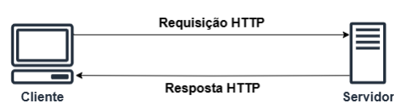

# API 

**API (Interface de Programação de Aplicações)** é um conjunto de regras que permite que diferentes sistemas se comuniquem. Nessa seção serão apresentados os conceitos do protocolo **HTTP** e arquitetura **REST**, que são fundamentais para o desenvolvimento e consumo de APIs modernas. 

O protocolo **HTTP**, ou **Hypertext Transfer Protocol**, é a base de comunicação da web, permitindo a transferência de dados entre clientes e servidores. Já a arquitetura REST (**Representational State Transfer**) é um tipo de arquitetura que utiliza o **HTTP** como protocolo de comunicação.  

## Protocolo HTTP 

O **HTTP** é um protocolo de comunicação utilizado para transferir dados na web. Ele é a base da comunicação entre navegadores (clientes) e servidores na Internet. Sempre que você acessa um site, seu navegador utiliza HTTP para enviar uma requisição ao servidor e receber a resposta.

Observando a figura, podemos entender como a arquitetura HTTP funciona: 

- Cliente faz uma requisição HTTP: 
    - Por exemplo, quando você digita uma URL no navegador, ele faz uma solicitação HTTP ao servidor correspondente; 
    - A requisição especifica o tipo de ação que o cliente quer realizar (ex.: obter um recurso, enviar dados, etc.). 

- Servidor responde: 
   - O servidor processa a solicitação e retorna uma resposta com o recurso solicitado (como uma página HTML, um arquivo JSON, etc.) ou uma mensagem de erro, caso algo dê errado. 

De acordo com o livro *HTTP: The Definitive Guide*, o protocolo HTTP possui as seguintes características: 

1. **Comunicação Cliente-Servidor**: como já evidenciado, o HTTP é baseado em um **modelo cliente-servidor**. O cliente, geralmente um navegador, envia solicitações ao servidor, que responde com os recursos solicitados. 

2. **Conexões Stateless**: Cada requisição HTTP é independente, ou seja, o protocolo não guarda informações sobre requisições anteriores. Isso o torna simples e escalável. 

3. **Métodos HTTP**: Esse protocolo define métodos como: 
    - GET: Para recuperar dados; 
    - POST: Para enviar dados ao servidor; 
    - PUT: Para atualizar ou criar dados; 
    - DELETE: Para remover dados; 
    - HEAD: Para obter apenas os cabeçalhos da resposta. 

4. **Mensagens HTTP**: As comunicações consistem em mensagens: 
    - Request (solicitação): Enviada pelo cliente ao servidor; 
    - Response (resposta): Retornada pelo servidor ao cliente; 
    - Ambas possuem cabeçalhos e, opcionalmente, um corpo com dados. 

5. **Endereçamento por URIs**: Cada recurso na web é identificado por um Uniform Resource Identifier (URI), como uma URL. 

6. **Códigos de Status**: As respostas incluem códigos que indicam o resultado da solicitação como (em seções a seguir serão explorados mais tipos de códigos de status de execução de APIs com protocolo HTTP): 
    - 200: Sucesso; 
    - 404: Recurso não encontrado; 
    - 500: Erro no servidor. 

7. **Uso do TCP/IP**: HTTP depende do protocolo TCP para comunicação confiável. 

8. **Extensibilidade**: É possível adicionar cabeçalhos e funcionalidades ao protocolo sem quebrar a compatibilidade. 

Essas características tornam o protocolo HTTP flexível e amplamente utilizado como o principal protocolo para a web moderna. 

